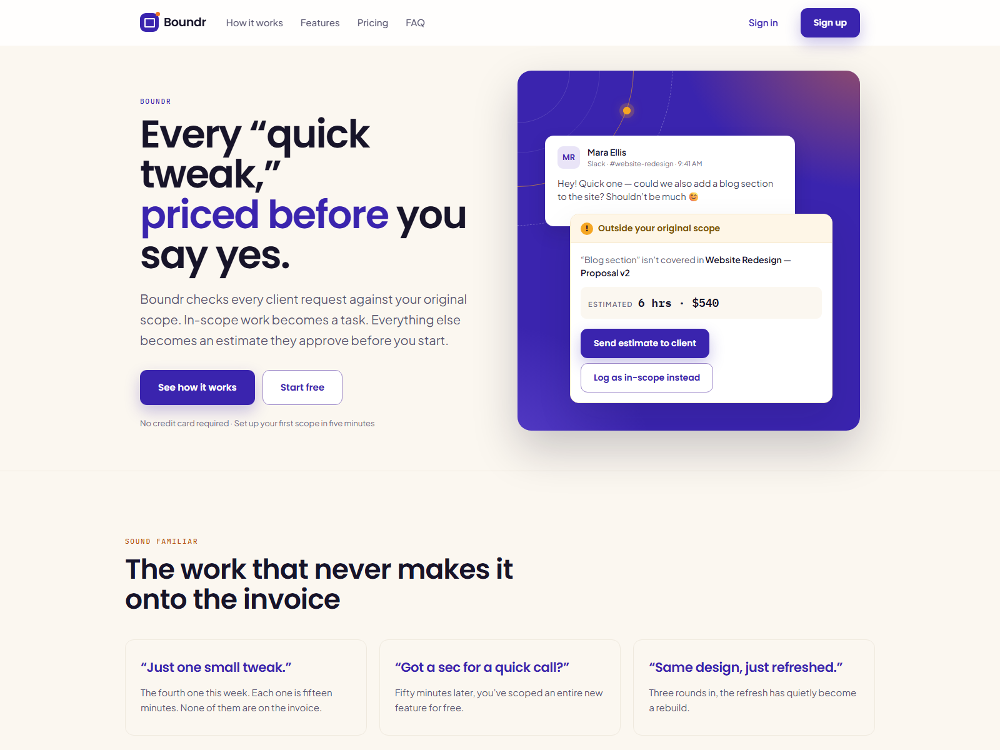
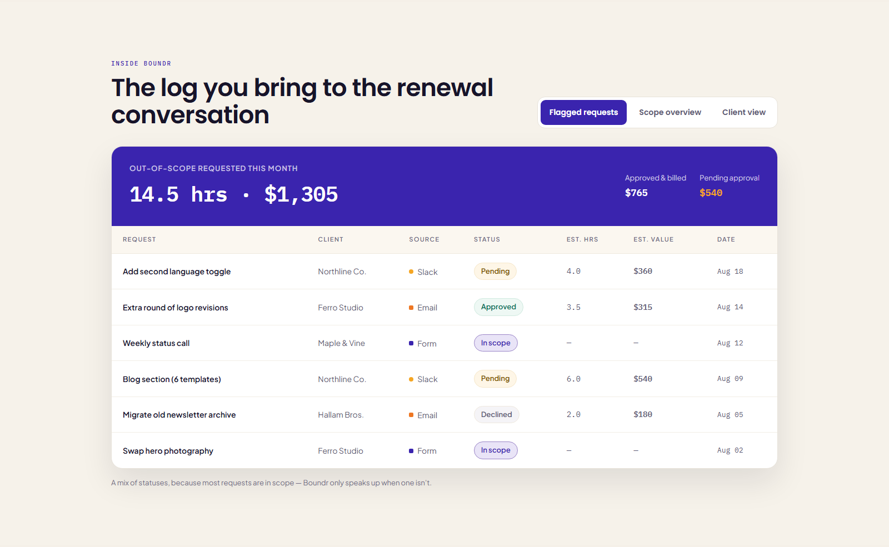
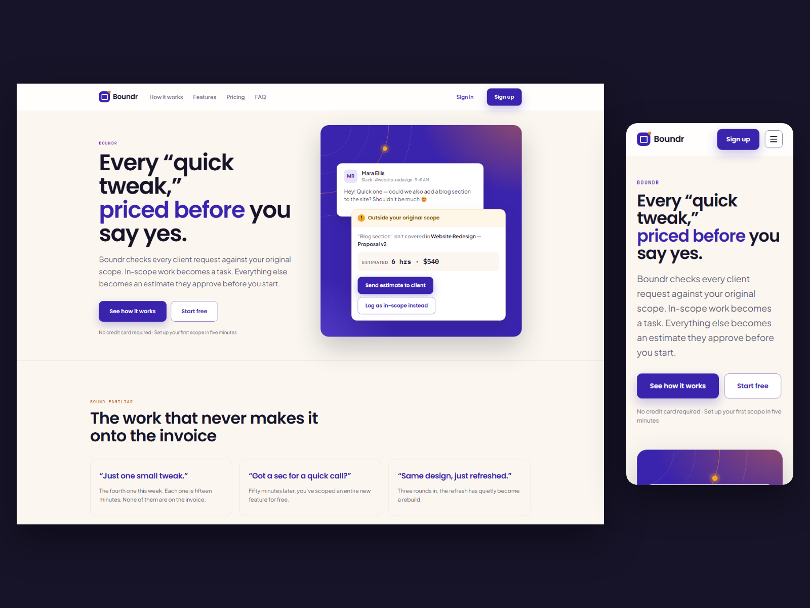

# Boundr Landing

**A complete SaaS landing page in plain HTML.** No build step, no framework, and
one file that holds every colour, size and radius on the page.



**[Live demo →](https://boundr-landing.netlify.app)**

Free for commercial work, on unlimited sites, with no attribution required.

---

## Quick start

```bash
git clone https://github.com/iveriontechnologies/boundr-landing.git
```

Then open `index.html` in a browser. That is the whole setup.

No Node, no npm, no build step, no terminal. If you can edit an HTML file you
can use this template. Prefer a zip? Use the green **Code → Download ZIP**
button, or [get it from Gumroad](https://iverion.gumroad.com/l/boundr).

> **Nothing here touches the internet.** Fonts, styles and scripts are all in
> this folder — no Google Fonts request, no CDN, no third-party request of any
> kind. It renders with the network unplugged, and there is no third-party data
> transfer to disclose to your visitors.

---

## Why you might want it

**Every design decision is a token.** All 296 colours, sizes, spacings, radii
and layout switches live in `assets/css/tokens.css`, and the Boundr look is 82
of them reassigned in `assets/css/themes/boundr.css`. Change `--color-accent`
and the page re-brands. There are no hex codes anywhere outside those two files.

**The layout is in tokens too.** No media queries scattered through the
stylesheet. Whether the nav shows links or a burger, whether the hero is one
column or two, whether the featured plan sits first or in the middle — each is a
custom property with a mobile value and a wider-screen override, together at the
bottom of `tokens.css`.

**It works with JavaScript off.** Not as a fallback someone remembered to test,
but because the markup is the finished page and the script only ever takes
things away. With no script: all seven FAQ answers are open and readable, all
three dashboard panels are stacked and reachable with their own headings, the
monthly prices show, and the drawer links are in the page.

**Accessibility is measured, not claimed.** One `h1`, no skipped heading levels,
a real `role="tablist"` with arrow-key navigation, `aria-expanded` on every
accordion, a skip link, and visible focus rings on every surface including the
violet ones. Six colours from the original design were changed because they
failed WCAG 1.4.3 or 1.4.11 — each is marked `FIXED` in the stylesheet with the
ratio that failed and the ratio that replaced it.

**No photographs, and none needed.** Every illustration — the Slack message, the
scope-flag popup, the dashboard, the file drop — is built from HTML and CSS.
Nothing to license, nothing to replace, nothing that breaks when a stock photo
URL dies.

### Measured on the copy you download

| | |
|---|---|
| Lighthouse performance | 98 |
| Lighthouse accessibility | 100 |
| Lighthouse best practices | 100 |
| Lighthouse SEO | 100 |
| Console errors | 0 |
| Checked at | 320 / 375 / 768 / 1024 / 1440 / 1920 px |

Measured with compression and cache headers, which is what a real host does.
Served from `python -m http.server` it scores lower, because that sends neither.

---

## What's in it

### One page, nine sections

| Section | What it is |
|---|---|
| Hero | Headline, sub, two calls to action, and a message-plus-flag illustration built entirely in HTML and CSS |
| Problem | Three "sound familiar" scenarios |
| How it works | Three numbered steps, each with its own small illustration |
| Features | A six-cell grid with one wide cell for the thing you actually differentiate on |
| Product demo | A tabbed dashboard: a scrolling data table, a scope breakdown with progress meters, and a client-facing card |
| Social proof | Three metric-led testimonials, plus a founder-story variant you can swap to |
| Pricing | Three plans with a monthly / annual toggle |
| FAQ | Seven questions, single-open accordion |
| Final CTA | Full-bleed panel with the closing ask |

Plus a sticky header with a mobile drawer, and a four-column footer.



### Nine behaviours, 13 KB of vanilla JavaScript, zero dependencies

Sticky nav · mobile drawer · reveal on scroll · animated KPI counters ·
dashboard tabs · single-open FAQ accordion · billing toggle · smooth scroll ·
full `prefers-reduced-motion` support.

### Files

```
index.html
assets/css/         4 stylesheets — tokens, theme, reset, boundr
assets/js/          1 script, no libraries
assets/img/         an SVG favicon and the social-share image
assets/fonts/       22 WOFF2 files + the SIL Open Font Licence for each family
site.webmanifest
CUSTOMISATION.md    how to change everything, written for non-developers
LICENSE.txt         what you may and may not do
CREDITS.md          every third-party asset and its licence
CHANGELOG.md        version history
```

40 files, 686 KB unzipped.



---

## Two things to change before you launch

1. **The testimonials and the founder story are fictional.** They were written
   for the demo. Publishing invented customer quotes on a live site is a false
   claim about people who do not exist. Replace them or delete the section.
2. **Boundr is not a real product.** The company, the pricing, the dashboard
   figures and the people named in it are all placeholder content.

`CUSTOMISATION.md` says where each of those lives. It is also worth swapping
`https://example.com` in the canonical and Open Graph tags for your own domain.

---

## What it is not

It is one page. The original design also specifies pricing, contact, blog and
sign-up screens, and those are not built. Every link points at a real in-page
anchor, so nothing leads to a 404 — but if you need six pages, this is a
starting point rather than a finished site.

It ships one theme. If you are looking for a template with a theme switcher,
that is a different product.

---

## Browser support

Chrome, Edge, Firefox and Safari, current and previous major versions. The
layout uses CSS grid, custom properties and `clamp()`; the script uses
`IntersectionObserver` with a failsafe, so an older browser that lacks it shows
the content immediately rather than not at all.

---

## Licence

Free for personal and commercial work, on unlimited sites, with no attribution
required. Modify anything. Hand finished sites to paying clients.

The one thing you may not do is resell or redistribute the template itself.
`LICENSE.txt` has the full terms.

Fonts are Poppins, Plus Jakarta Sans and IBM Plex Mono, all under the SIL Open
Font Licence, included in `assets/fonts/licences/`. `CREDITS.md` lists
everything.

---

## Why this is free

I sell HTML templates. This is the one I give away, because a screenshot only
tells you so much and I would rather you judged the work by opening it.

It is not a cut-down sample — it is built to the same standard as the ones I
charge for. If it is useful, the paid ones are at
[iverion.gumroad.com](https://iverion.gumroad.com).

Questions: iveriontechnologies@gmail.com. There is no support commitment
attached to a free template, but anything covered in `CUSTOMISATION.md` gets
answered when time allows.

---

Boundr Landing v1.0.0 — © 2026 Iverion Technologies
